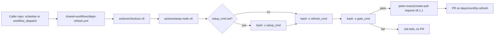

# shared-workflows

Reusable GitHub Actions workflows for the `weirdapps` org.

The repo is public so any weirdapps repo (public or private) can call the workflows via `uses:`. It currently ships one reusable workflow, `deps-refresh.yml`, which refreshes an npm lockfile, runs a caller-supplied gate command, and opens a pull request when the gate passes.

There is no CI in this repo itself; the workflow is exercised by its callers.

## Contents

| Workflow | Purpose |
|---|---|
| [`.github/workflows/deps-refresh.yml`](.github/workflows/deps-refresh.yml) | Node/npm dependency refresh: refresh the lockfile, run a validation command, open a PR with the changes. |

## `deps-refresh.yml`

A Node-focused reusable workflow that:

1. Checks out the caller repo (`actions/checkout` v6, pinned to a commit SHA).
2. Sets up Node (`actions/setup-node` v6, pinned to a commit SHA) at the requested version.
3. Optionally runs a caller-supplied `setup_cmd` (extra tooling install, etc.). Skipped when the input is empty.
4. Runs `refresh_cmd` to refresh the lockfile. Defaults to `npm update` followed by `npm install`.
5. Runs `gate_cmd` to validate the refreshed tree. If it exits non-zero, the workflow fails and no PR opens.
6. Opens a PR via `peter-evans/create-pull-request` v8.1.1 (pinned to a commit SHA) with a fixed branch, title, and label (see [Output](#output)).

Command inputs execute through env vars using `bash -euo pipefail -c "$VAR"`, never interpolated directly into a `run:` block, so caller-supplied strings cannot inject workflow syntax.

### Inputs

| Input | Required | Default | Description |
|---|---|---|---|
| `node_version` | no | `lts/*` | Node.js version passed to `actions/setup-node`. |
| `setup_cmd` | no | (empty) | Extra shell command to run before the refresh. Step is skipped when empty. |
| `refresh_cmd` | no | `npm update` then `npm install` | Command that refreshes the lockfile. |
| `gate_cmd` | yes | (none) | Validation command. Must exit 0 for the PR to open. |

### Secrets

| Secret | Required | Description |
|---|---|---|
| `PUSH_PAT` | no | PAT used by the PR step. Falls back to `github.token` when not provided. Use a PAT if you want the PR authored by a bot account rather than `github-actions[bot]`, or if you need cross-workflow triggers (PRs opened by `github.token` do not trigger other workflows). |

### Required caller permissions

The reusable workflow declares:

```yaml
permissions:
  contents: write
  pull-requests: write
```

A reusable workflow cannot escalate beyond the permissions the caller grants, so the caller job MUST also declare both. If either is missing, the checkout or PR step will fail.

### Caller example

Drop this into a caller repo at `.github/workflows/deps-refresh.yml`:

```yaml
name: Monthly Dependency Refresh

on:
  schedule:
    - cron: "37 6 18 * *"   # 06:37 UTC on the 18th of each month
  workflow_dispatch: {}

jobs:
  refresh:
    permissions:
      contents: write
      pull-requests: write
    uses: weirdapps/shared-workflows/.github/workflows/deps-refresh.yml@main
    with:
      node_version: "20"
      gate_cmd: npm test
    secrets: inherit
```

A caller that needs extra tooling before the refresh, or a non-default refresh command, can pass `setup_cmd` and override `refresh_cmd`:

```yaml
    with:
      node_version: "20"
      setup_cmd: npm ci
      refresh_cmd: |
        npm update
        npm install
      gate_cmd: npm run test:ci
```

Stagger the cron across repos so the shared runner minutes are not all consumed on the same day.

### Output

When `gate_cmd` passes, one PR is opened per run:

- Branch: `deps/monthly-refresh` (recreated each run via `delete-branch: true`).
- Commit and PR title: `deps: monthly dependency refresh`.
- Label: `dependencies`.
- Body: a short note that the refresh was produced by this shared reusable and that validation passed.

When `gate_cmd` fails, the job fails and no PR is opened.

## Flow



## Versioning

There are no tagged releases. Callers pin with either:

- `@main` to track the tip. Changes propagate immediately, which is fine for a small consumer set.
- `@<commit-sha>` for immutable pinning.

When making a breaking change here, switch pinned callers to a SHA on the previous commit first, then merge the change.

## Adding a new reusable workflow

1. Create `.github/workflows/<name>.yml` with an `on: workflow_call:` trigger.
2. Read any caller-supplied commands through `env:` and run them via `bash -euo pipefail -c "$VAR"`. Do not interpolate `${{ inputs.foo }}` directly into a `run:` block.
3. Pin third-party actions to a commit SHA and put the readable version in a comment above the `uses:` line.
4. Declare only the permissions the workflow actually needs, and document that the caller must grant them too (a reusable cannot escalate).
5. Add a section to this README documenting purpose, inputs, secrets, required caller permissions, and a caller example.

## Repo layout

```
.
├── .github/
│   └── workflows/
│       └── deps-refresh.yml
└── README.md
```

## License

No `LICENSE` file is present. Treat the contents as all rights reserved by the author (Dimitrios Plessas) until a license is added.
