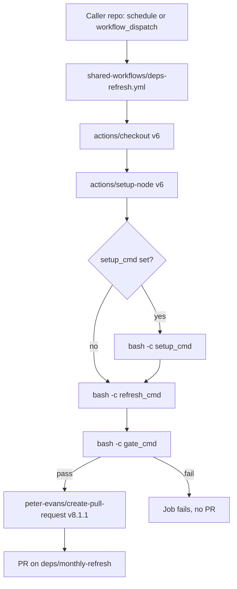

# shared-workflows

Reusable GitHub Actions workflows for the `weirdapps` org.

The repo is public so any weirdapps repo (public or private) can call the workflows via `uses:`.

There is no CI in this repo itself, with one exception: `gitleaks-self.yml` calls
this repo's own `gitleaks.yml` against its own copy of the canonical
`.gitleaks.toml`. That is the only thing proving the reusable still runs end to
end, and that the template still parses, before 30 repos copy a broken one.
Everything else here is exercised by its callers.

## Contents

| Workflow | Purpose |
|---|---|
| [`.github/workflows/deps-refresh.yml`](.github/workflows/deps-refresh.yml) | Node/npm dependency refresh: refresh the lockfile, run a validation command, open a PR with the changes. |
| [`.github/workflows/dependabot-auto-merge.yml`](.github/workflows/dependabot-auto-merge.yml) | Classify a Dependabot PR, wait for the caller's checks, squash-merge safe updates. Works without branch protection. |
| [`.github/workflows/gitleaks.yml`](.github/workflows/gitleaks.yml) | Full-history secret scan. Fails the build on any finding. The only server-side net the private repos have. |

This repo also carries the canonical [`.gitleaks.toml`](.gitleaks.toml), which every
other repo copies. gitleaks cannot extend a config over the network, so "shared"
means "copied from here"; this repo scanning itself with it keeps it honest.

## `deps-refresh.yml`

A Node-focused reusable workflow that:

1. Checks out the caller repo (`actions/checkout` v6, pinned to a commit SHA).
2. Sets up Node (`actions/setup-node` v6, pinned to a commit SHA) at the requested version.
3. Optionally runs a caller-supplied `setup_cmd` (extra tooling install, etc.). Skipped when the input is empty.
4. Runs `refresh_cmd` to refresh the lockfile. Defaults to `npm update` followed by `npm install`.
5. Runs `gate_cmd` to validate the refreshed tree. If it exits non-zero, the workflow fails and no PR opens.
6. Opens a PR via `peter-evans/create-pull-request` v8.1.1 (pinned to a commit SHA) with a fixed branch, title, and label (see [Output](#output)).

Command inputs execute through env vars using `bash -euo pipefail -c "$VAR"`, never interpolated directly into a `run:` block, so caller-supplied strings cannot inject workflow syntax.

### Inputs

| Input | Required | Default | Description |
|---|---|---|---|
| `node_version` | no | `lts/*` | Node.js version passed to `actions/setup-node`. |
| `setup_cmd` | no | (empty) | Extra shell command to run before the refresh. Step is skipped when empty. |
| `refresh_cmd` | no | `npm update` then `npm install` | Command that refreshes the lockfile. |
| `gate_cmd` | yes | (none) | Validation command. Must exit 0 for the PR to open. |

### Secrets

| Secret | Required | Description |
|---|---|---|
| `PUSH_PAT` | no | PAT used by the PR step. Falls back to `github.token` when not provided. Use a PAT if you want the PR authored by a bot account rather than `github-actions[bot]`, or if you need cross-workflow triggers (PRs opened by `github.token` do not trigger other workflows). |

### Required caller permissions

The reusable workflow declares:

```yaml
permissions:
  contents: write
  pull-requests: write
```

A reusable workflow cannot escalate beyond the permissions the caller grants, so the caller job MUST also declare both. If either is missing, the checkout or PR step will fail.

### Caller example

Drop this into a caller repo at `.github/workflows/deps-refresh.yml`:

```yaml
name: Monthly Dependency Refresh

on:
  schedule:
    - cron: "37 6 18 * *"   # 06:37 UTC on the 18th of each month
  workflow_dispatch: {}

jobs:
  refresh:
    permissions:
      contents: write
      pull-requests: write
    uses: weirdapps/shared-workflows/.github/workflows/deps-refresh.yml@main
    with:
      node_version: "20"
      gate_cmd: npm test
    secrets: inherit
```

A caller that needs extra tooling before the refresh, or a non-default refresh command, can pass `setup_cmd` and override `refresh_cmd`:

```yaml
    with:
      node_version: "20"
      setup_cmd: npm ci
      refresh_cmd: |
        npm update
        npm install
      gate_cmd: npm run test:ci
```

Stagger the cron across repos so the shared runner minutes are not all consumed on the same day.

### Output

When `gate_cmd` passes, the run opens a PR, or updates the one still open from a previous run:

- Branch: `deps/monthly-refresh`. Reused and force-updated while a PR is open, so consecutive runs update that single PR rather than opening a second. `delete-branch: true` removes the branch once no active PR references it, that is, after the PR merges or closes.
- Commit and PR title: `deps: monthly dependency refresh`.
- Label: `dependencies`.
- Body: a short note that the refresh was produced by this shared reusable and that validation passed.

When `gate_cmd` fails, the job fails and no PR is opened.

## `dependabot-auto-merge.yml`

Classifies a Dependabot PR, waits for the caller's own checks, and squash-merges the safe ones. An ungrouped major is always left open for manual review. A grouped update is merged under the defaults even when its aggregate level is major, unless the caller sets `allow_major_in_group: false`.

### Why this exists

GitHub's native auto-merge (`gh pr merge --auto`) requires **both** `allow_auto_merge` on the repository **and** a branch-protection rule to gate on. Neither is reliably available in this org:

- Branch protection on a **private** repo is a paid feature on the current plan, so `GET /repos/{r}/branches/{b}/protection` returns `403 Upgrade to GitHub Pro`.
- `PATCH /repos/{r} allow_auto_merge=true` **silently no-ops** on a private repo. It returns `200` with `allow_auto_merge: false`.

So `--auto` fails with either `Auto merge is not allowed for this repository` or `Protected branch rules not configured for this branch`, the job exits non-zero, and every patch and minor Dependabot PR piles up indefinitely. This workflow tries `--auto` first (cheapest and correct where it does work) and otherwise polls the PR's checks itself and merges once they are green.

The poll **excludes the caller workflow's own checks**, matched on `.workflow != github.workflow`. This job is itself a check on the same PR, so waiting for "all checks" would wait for itself and deadlock until the job timeout.

### Inputs

| Input | Required | Default | Description |
|---|---|---|---|
| `allow_minor` | no | `true` | Auto-merge `semver-minor` and `semver-patchminor`. Set `false` for patch-only. Applies to ungrouped PRs only: a grouped PR is decided entirely by `allow_grouped` and `allow_major_in_group`, which override this. |
| `allow_grouped` | no | `true` | Auto-merge grouped updates. Set `false` to leave every group for manual review. |
| `allow_major_in_group` | no | `true` | Auto-merge a group whose aggregate level is `semver-major`. Set `false` for the stricter "a major is never auto-merged, not even inside a group" policy while still auto-merging safe groups. Only consulted when `allow_grouped` is true. |
| `exclude_branch_prefixes` | no | `""` | Whitespace-separated head-branch prefixes to skip, for example `dependabot/pip/`. Use where Dependabot edits a *derived* lockfile and would desync the real source of truth. |
| `checks_timeout_minutes` | no | `45` | How long to wait for the caller's checks before failing. The job's own `timeout-minutes` is 60 and is not caller-overridable, so a value at or above 60 is cut short by the job timeout instead. |
| `merge_method` | no | `squash` | `squash`, `merge`, or `rebase`. |

### Secrets

None. Uses the automatic `GITHUB_TOKEN`.

### Required caller permissions

The caller job must grant at least what the reusable declares, because a reusable workflow cannot escalate:

```yaml
permissions:
  contents: write
  pull-requests: write
```

### Caller example

```yaml
name: Dependabot auto-merge
'on': pull_request

permissions:
  contents: write
  pull-requests: write

jobs:
  auto-merge:
    uses: weirdapps/shared-workflows/.github/workflows/dependabot-auto-merge.yml@main
```

With a repo-specific exclusion. Use this where Dependabot edits a *derived* lockfile, for example a Poetry repo in which `poetry.lock` is the source of truth but pip-Dependabot only rewrites the generated `requirements-*-lock.txt`. `etorotrade` is the caller that uses it, with `dependabot/pip/`.

```yaml
jobs:
  auto-merge:
    uses: weirdapps/shared-workflows/.github/workflows/dependabot-auto-merge.yml@main
    with:
      exclude_branch_prefixes: "dependabot/pip/"
```

With the stricter major policy (`outlook-access`, `plessas-marketplace`, `teams-access`), where a major must never land unreviewed even as part of a group:

```yaml
jobs:
  auto-merge:
    uses: weirdapps/shared-workflows/.github/workflows/dependabot-auto-merge.yml@main
    with:
      allow_major_in_group: false
```

### Behaviour

- Not a Dependabot PR: the job is skipped by its `if:` guard.
- Ungrouped major bump, or an excluded branch prefix: classified `merge=false`, a note is written to the step summary, PR stays open.
- Grouped update: the grouped inputs are the sole decider and overwrite the update-type verdict, so `allow_minor` is ignored here. Under the defaults the group merges even when its aggregate level is major; set `allow_major_in_group: false` to hold those.
- Any non-self check fails: the failing `workflow / job` names are printed and the job exits non-zero. Nothing is merged.
- Checks still pending past `checks_timeout_minutes`: the job fails rather than merging blind.
- Caller has no CI at all: only the self-check exists, so the poll sees zero other checks and merges immediately.
- Merge loses a race to another PR: retried three times, then the workflow comments `@dependabot rebase` and exits cleanly. Dependabot's rebase re-triggers the workflow.

## `gitleaks.yml`

Scans the caller repo's **full history** for secrets and fails the build on any
finding. Honours the caller's own `.gitleaks.toml` and `.gitleaksignore`.

### Why this exists

GitHub's native secret scanning needs Advanced Security. On this plan that is not
available for private repos: it is disabled on all 13 of them and reports nothing
at all. The public repos do get it, and report 0 open alerts. So the private half
of the estate had no server-side net whatsoever, which is how a live API key sat
in `claude-config`'s history for 105 days before a manual sweep found it.

Pre-commit hooks do not close that gap. They never run for a commit pushed by
Actions, for a commit made on a machine where the hook was never installed, or
for one made with `--no-verify`.

### Why it runs the binary instead of `gitleaks/gitleaks-action`

The action scopes its scan **by event**. On `push` and `pull_request` it passes a
`--log-opts` range, so it sees only the commits in that push; full history is
scanned only on `workflow_dispatch` and `schedule`. A secret committed before the
workflow existed is therefore invisible on exactly the events that run most
often, which is the whole gap being closed. Invoking the binary directly makes
the scan scope identical on every event.

`etorotrade` hit the other half of the same problem in September 2026: the
action's default gitleaks 8.24.3 silently ignores top-level `[[allowlists]]`, so
its suppressions were dead and the nightly run went red on four known-good
findings for nine days.

### Inputs

| Input | Required | Default | Description |
|---|---|---|---|
| `gitleaks_version` | no | `8.30.1` | gitleaks release to pin, without the leading `v`. |
| `gitleaks_sha256` | no | digest of the default version | sha256 of `gitleaks_<version>_linux_x64.tar.gz`. A caller overriding `gitleaks_version` MUST override this too, or the checksum step fails. |
| `config_path` | no | `.gitleaks.toml` | Caller's gitleaks config, relative to the repo root. When absent the scan still runs on the default ruleset and the job warns rather than failing, so a repo is never silently unscanned. |

The digest is committed here rather than fetched from the release's own
`checksums.txt`. Verifying a download against a checksum file from the same
release only proves the bytes arrived intact; it proves nothing if the release
itself is replaced.

### Secrets

None. The scan needs no credentials.

### Required caller permissions

```yaml
permissions:
  contents: read
```

### Caller example

```yaml
name: Secret Scan

'on':
  push:
    branches: [master]
  pull_request:
  schedule:
    - cron: "17 4 * * 1"   # stagger this across repos
  workflow_dispatch: {}

permissions:
  contents: read

concurrency:
  group: gitleaks-${{ github.ref }}
  cancel-in-progress: true

jobs:
  gitleaks:
    uses: weirdapps/shared-workflows/.github/workflows/gitleaks.yml@main
```

`cancel-in-progress` is safe here and is worth having on a repo that takes
machine-written commits: every run scans the same full history, so a later run
strictly supersedes the one it cancels.

### Behaviour

- Checks out with `fetch-depth: 0`. This is load-bearing. The default depth-1
  checkout hands gitleaks one commit and silently reduces the job to a scan of
  the push.
- Downloads the pinned gitleaks release, verifies it against the committed
  sha256, and puts it on `PATH` from `RUNNER_TEMP`. No `sudo`, no third-party
  action.
- Runs `gitleaks git . --redact --exit-code 2`. `--redact` keeps values out of
  the Actions log, which for a public repo would otherwise publish them twice.
- `--exit-code 2` separates "found something" from "the scanner broke". gitleaks
  exits 1 on its own errors, so without it a config that fails to parse is
  indistinguishable from a real finding, and the red build gets triaged as the
  wrong thing. Exit 2 fails the job with a findings table; any other non-zero
  fails it with a scanner-error annotation.
- Findings are written to the job summary as `rule | file | line | commit`, with
  the reproduction command. Values stay redacted.
- No config at `config_path`: the job warns and scans on the default ruleset. It
  does not fail, because a repo with no config is still worth scanning.

### Triage contract

A finding that is provably not a credential goes in the repo's `.gitleaks.toml`
allowlist, as a **narrow** regex, with its reason written down. A real one is
**rotated first**, then pinned in `.gitleaksignore` with its revocation date.
Never pin a live credential: the pin makes it invisible without making it safe.

Use the singular `[allowlist]` table, not `[[allowlists]]`. gitleaks 8.24.3 parses
`[[rules]]` but silently ignores the plural form, and the two cannot be mixed
either: 8.30.1 refuses to load a config containing both, with `[allowlist] is
deprecated, it cannot be used alongside [[allowlists]]`.

## `deps-refresh.yml` flow


```mermaid
flowchart TD
  A[Caller repo: schedule or workflow_dispatch] --> B[shared-workflows/deps-refresh.yml]
  B --> C[actions/checkout v6]
  C --> D[actions/setup-node v6]
  D --> E{setup_cmd set?}
  E -- yes --> F[bash -c setup_cmd]
  E -- no --> G[bash -c refresh_cmd]
  F --> G
  G --> H[bash -c gate_cmd]
  H -- pass --> I[peter-evans/create-pull-request v8.1.1]
  H -- fail --> X[Job fails, no PR]
  I --> J[PR on deps/monthly-refresh]
```

## Versioning

There are no tagged releases. Callers pin with either:

- `@main` to track the tip. Changes propagate immediately, which is fine for a small consumer set.
- `@<commit-sha>` for immutable pinning.

When making a breaking change here, switch pinned callers to a SHA on the previous commit first, then merge the change.

## Adding a new reusable workflow

1. Create `.github/workflows/<name>.yml` with an `on: workflow_call:` trigger.
2. Read any caller-supplied commands through `env:` and run them via `bash -euo pipefail -c "$VAR"`. Do not interpolate `${{ inputs.foo }}` directly into a `run:` block.
3. Pin third-party actions to a commit SHA and put the readable version in a comment above the `uses:` line.
4. Declare only the permissions the workflow actually needs, and document that the caller must grant them too (a reusable cannot escalate).
5. Add a section to this README documenting purpose, inputs, secrets, required caller permissions, and a caller example.

## Repo layout

```
.
├── .github/
│   └── workflows/
│       ├── dependabot-auto-merge.yml
│       ├── deps-refresh.yml
│       └── gitleaks.yml
├── .gitleaks.toml        # canonical template, copied into every other repo
├── CLAUDE.md
├── LICENSE
└── README.md
```

## License

MIT, see [LICENSE](LICENSE). Copyright (c) 2026 Dimitrios Plessas.
